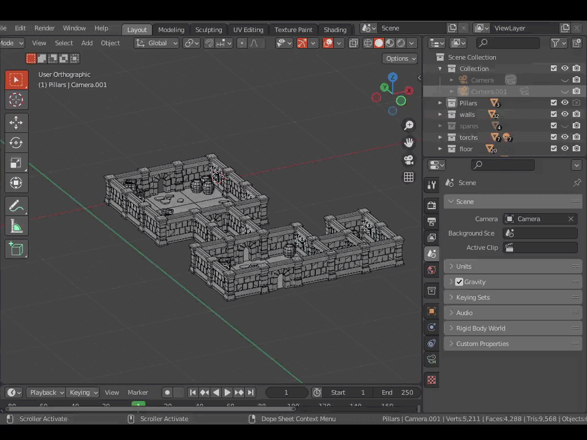

  <h3>👋 Olá | Hi | Salve | γεια | Здравствуй | こんにちは | Ciao </h3>
  <h3> Paulo Ferr is Learning Computer Graphics and Programming. Estudante de Análise e Desenvolvimento de Sistemas</h3>
   

<!-- Languages icons -->

  
   
   
 

-----------------------------------------------------------------------------------------------------------------------------

  <h2> Current Work </h2>
   
  
 

<footer>
  
2022 - <a href="https://www.instagram.com/pauloferrdraw/" target="_blank">@pauloferrdraw</a>
</footer>

<!--
**pauloferrti/pauloferrti** is a ✨ _special_ ✨ repository because its `README.md` (this file) appears on your GitHub profile.

Here are some ideas to get you started:

- 🔭 I’m currently working on ...
- 🌱 I’m currently learning ...
- 👯 I’m looking to collaborate on ...
- 🤔 I’m looking for help with ...
- 💬 Ask me about ...
- 📫 How to reach me: ...
- 😄 Pronouns: ...
- ⚡ Fun fact: ...
-->
